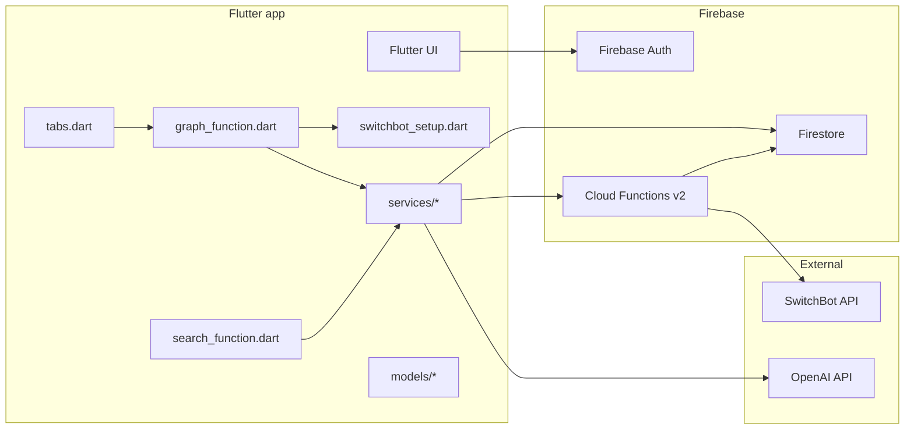
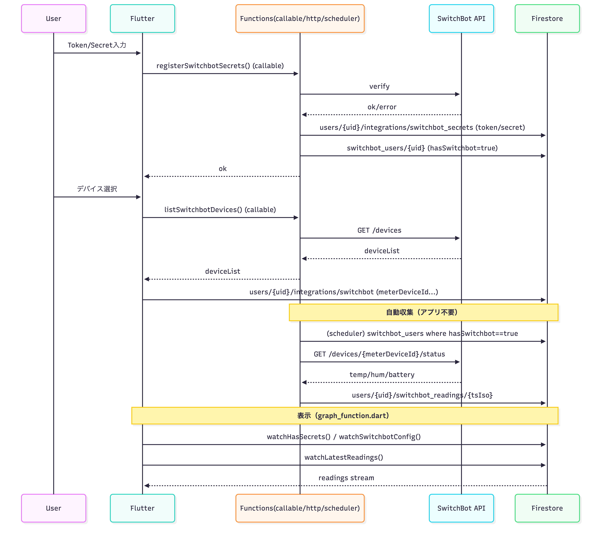
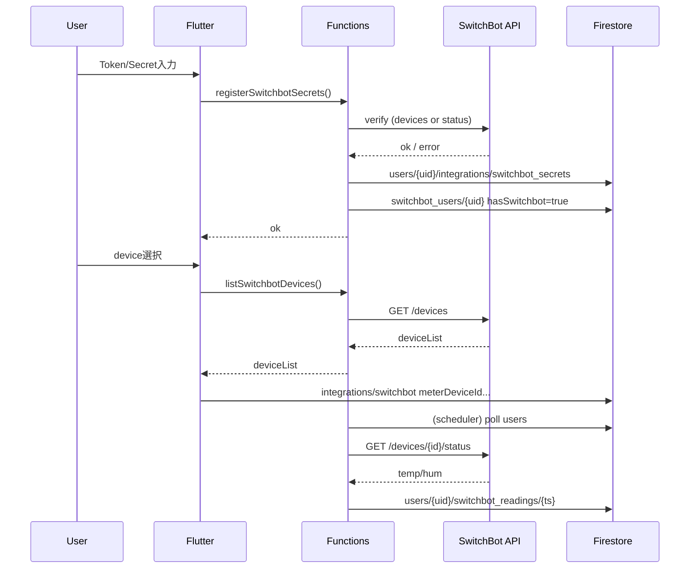

# Architecture

## Dependency rules (must-follow)

このプロジェクトは「依存の向き」を固定して、改修で壊れないようにする。

### Allowed dependencies (OK)
- lib/screens/*  -> lib/services/*, lib/models/*, lib/widgets/*, lib/theme/*, lib/config/*
- lib/services/* -> lib/models/*, lib/config/*
- lib/widgets/*  -> lib/theme/*, lib/models/* (必要最小限)
- lib/models/*   -> (no dependency / pure data)
- functions/src/* -> Firestore, External APIs (SwitchBotなど)

### Forbidden dependencies (NG)
- lib/services/* -> lib/screens/*  (循環・密結合の原因)
- lib/widgets/*  -> lib/services/* (UI部品が肥大化する)
- lib/models/*   -> Firebase packages (モデルを純粋に保つ)

### Rules of thumb
- 画面(screens)は「表示とユーザー操作」まで。データ取得や保存は services に寄せる。
- Firebase/Firestore/Functions を screens から直叩きしない（移行中の例外はOKだが TODO を付けて消す）。

---

## System overview

---

## SwitchBot data flow

