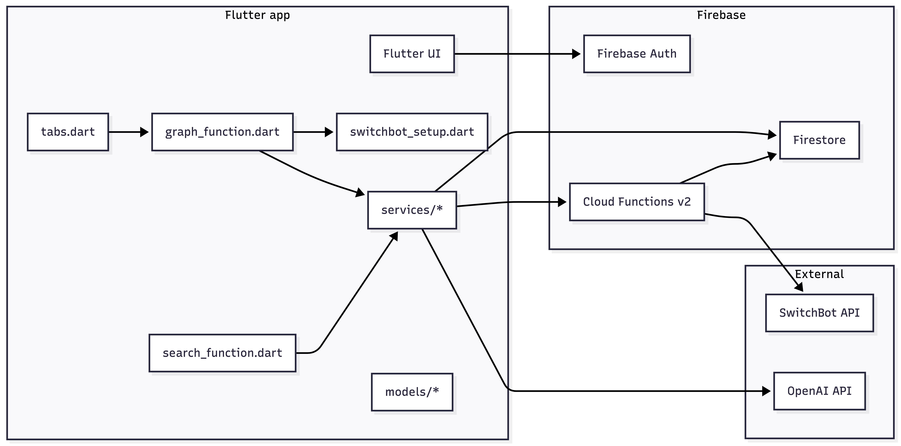
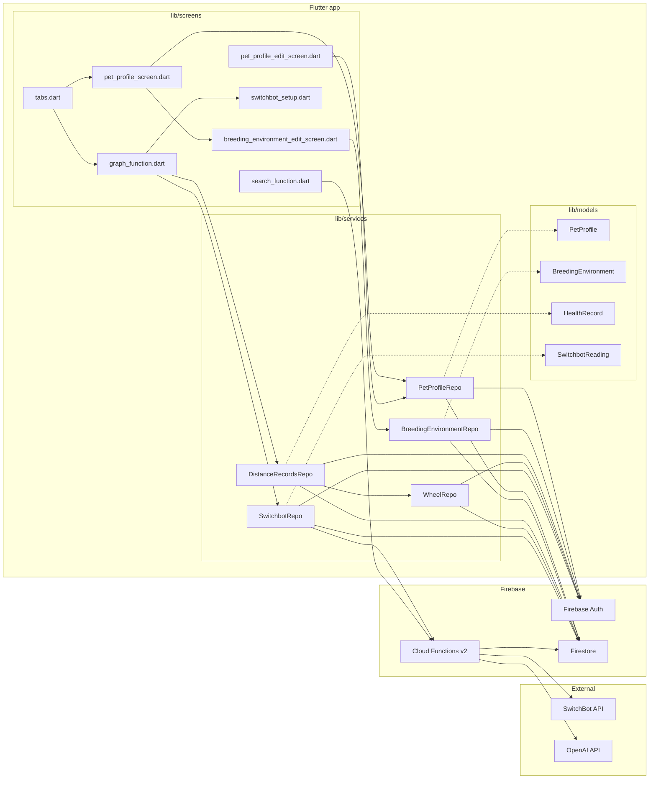
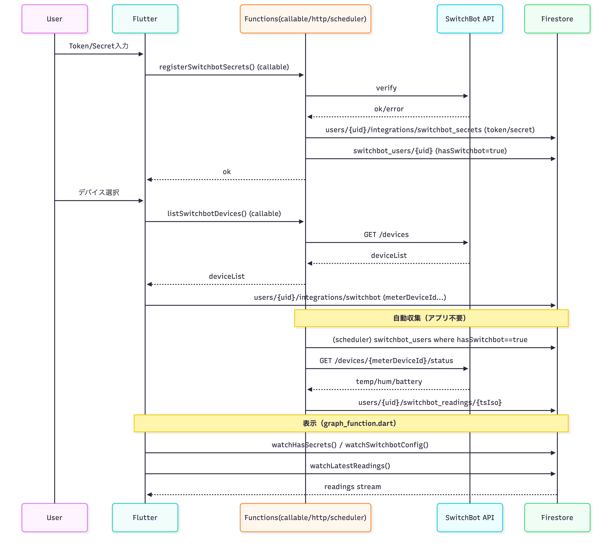
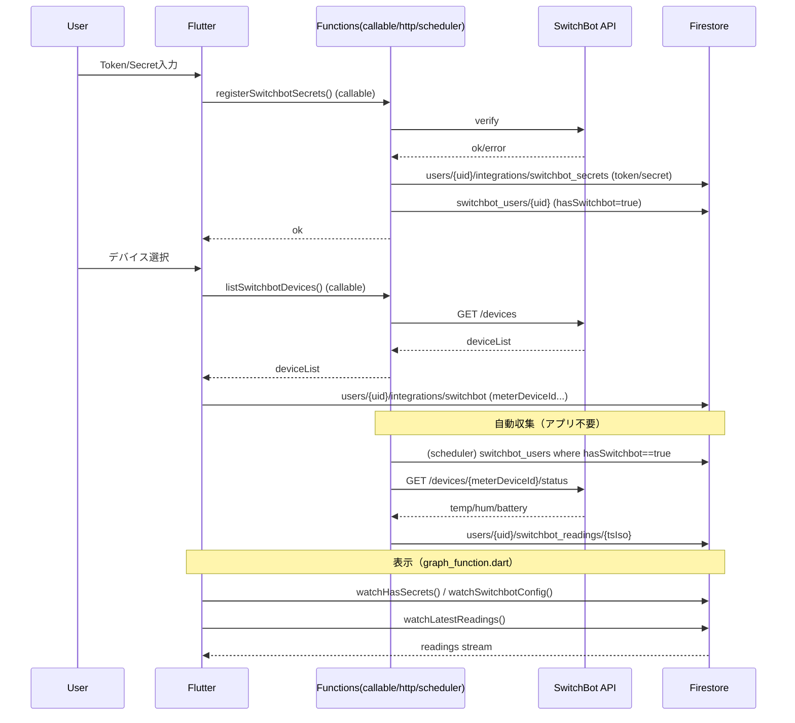

# Architecture

## Dependency rules (must-follow)

このプロジェクトは「依存の向き」を固定して、改修で壊れないようにする。

### Allowed dependencies (OK)
- `lib/screens/*`  -> `lib/services/*`, `lib/models/*`, `lib/widgets/*`, `lib/theme/*`, `lib/config/*`
- `lib/services/*` -> `lib/models/*`, `lib/config/*`
- `lib/widgets/*`  -> `lib/theme/*`, `lib/models/*` (必要最小限)
- `lib/models/*`   -> 依存なし（pure data）
- `functions/src/*` -> Firestore, External APIs (SwitchBotなど)

### Forbidden dependencies (NG)
- `lib/services/*` -> `lib/screens/*`  （循環・密結合の原因）
- `lib/widgets/*`  -> `lib/services/*` （UI部品が肥大化する）
- `lib/models/*`   -> Firebase packages （モデルを純粋に保つ）

### Rules of thumb
- 画面 (`screens`) は「表示とユーザー操作」まで。データ取得や保存は `services` に寄せる。
- Firebase / Firestore / Functions を screens から直叩きしない。
- Firestore の保存形式変更は、まず `services` に閉じ込めてから UI を追従させる。
- 同じ意味のデータは、UI側で個別整形せず、できるだけ service / model 側で揃えた形で返す。

---

## System overview

### Main layers
- `lib/screens`
  - 画面表示
  - ユーザー操作の受付
  - service / repo 呼び出し
  - 画面遷移

- `lib/services`
  - Firestore 読み書き
  - 外部API / Firebase とのやり取り
  - 表示用の状態生成
  - 集計、比較、意味づけ

- `lib/models`
  - Firestore / service / UI の間で受け渡す純粋データ
  - 表示共通DTO（例: `MetricCardViewData`）もここに置く

- `lib/widgets`
  - 複数画面で再利用するUI部品
  - 単体で完結する描画ロジック

### Main dependency graph
- `tabs.dart` -> `home.dart`, `graph_function.dart`, `search_function.dart`
- `home.dart` -> `EnvironmentAssessmentRepo`, `EnvironmentStatusService`, `EnvironmentTrendService`, `SemanticSparkline`
- `daily_status_detail.dart` -> `EnvironmentAssessmentRepo`, `DistanceRecordsRepo`, `ActivityTrendService`, `EnvironmentStatusService`, `SemanticSparkline`
- `graph_function.dart` -> `DistanceRecordsRepo`, `WheelRepo`, `SwitchbotRepo`, `switchbot_setup.dart`, `breeding_environment_edit_screen.dart`
- `search_function.dart` -> Cloud Functions
- `pet_profile_edit_screen.dart` -> `PetProfileRepo`
- `breeding_environment_edit_screen.dart` -> `BreedingEnvironmentRepo`

### Service to model dependencies
- `EnvironmentAssessmentRepo` -> `EnvironmentAssessment`, `EnvironmentAssessmentHistory`
- `EnvironmentStatusService` -> `MetricCardViewData`, `SemanticChartBand`
- `EnvironmentTrendService` -> `EnvironmentAssessment`
- `ActivityTrendService` -> `ActivitySummary`, `ActivityDistribution`, `MetricCardViewData`, `SemanticChartBand`
- `DistanceRecordsRepo` -> `HealthRecord`
- `BreedingEnvironmentRepo` -> `BreedingEnvironment`
- `PetProfileRepo` -> `PetProfile`
- `SwitchbotRepo` -> `SwitchbotReading`

### Reusable UI dependencies
- `home.dart` -> `SemanticSparkline`
- `daily_status_detail.dart` -> `SemanticSparkline`
- `SemanticSparkline` -> `SemanticChartBand`

---

## Key design decisions

### 1. Repository と表示ロジックを分離する
- Firestore の読み書きは `Repo` に閉じ込める。
- 状態評価やカード表示用の文言生成は `Service` に寄せる。
- Screen は「どの service を呼ぶか」と「どう並べて見せるか」に集中する。

### 2. 走行距離は `distance_records` を正とする
- 旧 `health_records/{autoId}` 方式ではなく、`distance_records/{dayKey}` を正規構造とする。
- 同日再入力は上書き。
- 日次グラフ、平均、比較表示を単純化する。

### 3. UIカードは共通の返却思想で扱う
- `EnvironmentStatusService` と `ActivityTrendService` は、どちらも「UIが1枚のカードを描くための情報」を返す方向に揃える。
- その中心が `MetricCardViewData`。

### 4. 見た目の共通部品は widget 化する
- 例: `SemanticSparkline`
- 同じ見た目ロジックを screen ごとに再実装しない。

---

## Distance records data flow

```mermaid
flowchart LR
  %% ===== Flutter =====
  subgraph App[Flutter app]
    subgraph Screens[lib/screens]
      Tabs[tabs.dart]
      PetScreen[pet_profile_screen.dart]
      PetEdit[pet_profile_edit_screen.dart]
      BreedEdit[breeding_environment_edit_screen.dart]
      Graph[graph_function.dart]
      SwitchSetup[switchbot_setup.dart]
      Search[search_function.dart]
    end

    subgraph Services[lib/services]
      PetRepo[PetProfileRepo]
      BreedRepo[BreedingEnvironmentRepo]
      HealthRepo[DistanceRecordsRepo]
      WheelRepo[WheelRepo]
      SBRepo[SwitchbotRepo]
    end

    subgraph Models[lib/models]
      PetModel[PetProfile]
      BreedModel[BreedingEnvironment]
      HealthModel[HealthRecord]
      SBModel[SwitchbotReading]
    end
  end

  %% ===== Firebase / External =====
  subgraph Firebase[Firebase]
    Auth[Firebase Auth]
    FS[Firestore]
    CF[Cloud Functions v2]
  end

  subgraph External[External]
    SB[SwitchBot API]
    OAI[OpenAI API]
  end

  %% ===== Screen -> Repo =====
  Tabs --> PetScreen
  Tabs --> Graph

  PetScreen --> PetRepo
  PetScreen --> BreedEdit
  PetEdit --> PetRepo
  BreedEdit --> BreedRepo

  Graph --> HealthRepo
  HealthRepo --> WheelRepo
  Graph --> SBRepo
  Graph --> SwitchSetup

  Search --> CF

  %% ===== Repo -> Firebase =====
  PetRepo --> FS
  BreedRepo --> FS
  HealthRepo --> FS
  WheelRepo --> FS
  SBRepo --> FS

  PetRepo --> Auth
  BreedRepo --> Auth
  HealthRepo --> Auth
  WheelRepo --> Auth
  SBRepo --> Auth

  SBRepo --> CF
  CF --> FS
  CF --> SB
  CF --> OAI

  %% ===== Repo uses Model (dotted) =====
  PetRepo -.-> PetModel
  BreedRepo -.-> BreedModel
  HealthRepo -.-> HealthModel
  SBRepo -.-> SBModel
```
### 入力から保存まで
1. User が `graph_function.dart` で日付と回転数を入力する。
2. Screen は `DistanceRecordsRepo.previewDistanceFromRotations(rotations)` を呼ぶ。
3. Repo は `WheelRepo.fetchWheelDiameter()` で `breeding_environments/main_env` から車輪直径を読む。
4. Repo は回転数から距離(m)を計算し、UIに返す。
5. User が保存を押す。
6. Screen は `DistanceRecordsRepo.addWheelRotationRecord(rotations, date)` を呼ぶ。
7. Repo は `users/{uid}/distance_records/{dayKey}` に upsert する。
8. 同日の既存レコードがあれば上書きし、無ければ新規作成する。

### 表示用の読み取り
- `fetchDailyTotalDistance()` で当日値を取得
- `fetchRollingDailyAverage()` で直近平均を取得
- `fetchDailyDistanceSeries()` で直近N日系列を取得
- `fetchAllDailyDistanceSeries()` で全期間系列を取得
- `watchDistanceSeries()` でグラフをストリーム購読

---

## Daily status detail data flow

### 読み取りの流れ
1. `daily_status_detail.dart` が `EnvironmentAssessmentRepo.fetchLatest()` を呼ぶ。
2. 同画面が `EnvironmentAssessmentRepo.fetchRecentHistory(limit: 7)` を呼ぶ。
3. 同画面が `DistanceRecordsRepo` から当日値、7日平均、直近系列、全期間系列を読む。
4. `EnvironmentStatusService` が温度・湿度の状態を `MetricCardViewData` 付きで返す。
5. `ActivityTrendService` が活動量サマリーを `ActivitySummary` と `MetricCardViewData` 付きで返す。
6. Screen はそれらを並べて表示する。

### 責務分担
- Repo: Firestore から取る
- Service: 意味づけする
- Screen: 並べて見せる

---

## SwitchBot data flow

```mermaid
sequenceDiagram
  participant U as User
  participant App as Flutter
  participant CF as Functions(callable/http/scheduler)
  participant SB as SwitchBot API
  participant FS as Firestore

  U->>App: Token/Secret入力
  App->>CF: registerSwitchbotSecrets() (callable)
  CF->>SB: verify
  SB-->>CF: ok/error
  CF->>FS: users/{uid}/integrations/switchbot_secrets (token/secret)
  CF->>FS: switchbot_users/{uid} (hasSwitchbot=true)
  CF-->>App: ok

  U->>App: デバイス選択
  App->>CF: listSwitchbotDevices() (callable)
  CF->>SB: GET /devices
  SB-->>CF: deviceList
  CF-->>App: deviceList
  App->>FS: users/{uid}/integrations/switchbot (meterDeviceId...)

  Note over CF,FS: 自動収集（アプリ不要）
  CF->>FS: (scheduler) switchbot_users where hasSwitchbot==true
  CF->>SB: GET /devices/{meterDeviceId}/status
  SB-->>CF: temp/hum/battery
  CF->>FS: users/{uid}/switchbot_readings/{tsIso}

  Note over App,FS: 表示（graph_function.dart）
  App->>FS: watchHasSecrets() / watchSwitchbotConfig()
  App->>FS: watchLatestReadings()
  FS-->>App: readings stream
```
### 初回連携
1. User が token / secret を入力
2. App が `registerSwitchbotSecrets()` を callable function に送る
3. Cloud Functions が SwitchBot API で検証
4. 成功したら Firestore に保存
   - `users/{uid}/integrations/switchbot_secrets`
   - `switchbot_users/{uid}`

### デバイス選択
1. User がデバイス一覧取得を要求
2. App が `listSwitchbotDevices()` を呼ぶ
3. Cloud Functions が SwitchBot API `/devices` を呼ぶ
4. App が選択結果を
   - `users/{uid}/integrations/switchbot`
   に保存する

### 自動収集
- Scheduler が `switchbot_users` を走査
- 各ユーザーの `meterDeviceId` を参照
- SwitchBot API の status を取得
- `users/{uid}/switchbot_readings/{tsIso}` に保存

### アプリ表示
- App は `watchHasSecrets()`, `watchSwitchbotConfig()`, `watchLatestReadings()` で購読する

---

## Naming policy

### Repositories
永続化やデータアクセスを担当するものは `*Repo`
- `DistanceRecordsRepo`
- `EnvironmentAssessmentRepo`
- `PetProfileRepo`

### Services
状態評価や表示生成を担当するものは `*Service`
- `EnvironmentStatusService`
- `EnvironmentTrendService`
- `ActivityTrendService`

### Models
純粋データ、および表示共通DTO
- `EnvironmentAssessment`
- `ActivitySummary`
- `MetricCardViewData`

---

## Migration note

旧構造では、走行距離は `HealthRecordsRepo` + `health_records` を前提としていた。  
現在は以下に移行済み。

- class: `HealthRecordsRepo` -> `DistanceRecordsRepo`
- collection: `health_records` -> `distance_records`
- document id: `autoId` -> `dayKey (yyyy-MM-dd)`

今後の新規実装は、必ず `DistanceRecordsRepo` / `distance_records` を基準にする。

---

## Maintenance guidance

将来の機能追加では、まず次の順で考える。

1. **これは screen の責務か？**
   - 単なる表示なら screen
   - 意味づけ・集計・文言生成なら service

2. **これは Firestore 保存形式の責務か？**
   - yes なら repo に閉じ込める

3. **複数画面で同じ見た目を使うか？**
   - yes なら widget 化する

4. **複数機能で同じ表示データ構造を使えるか？**
   - yes なら model / DTO として切り出す

この順番を守ると、機能追加しても壊れにくい。
